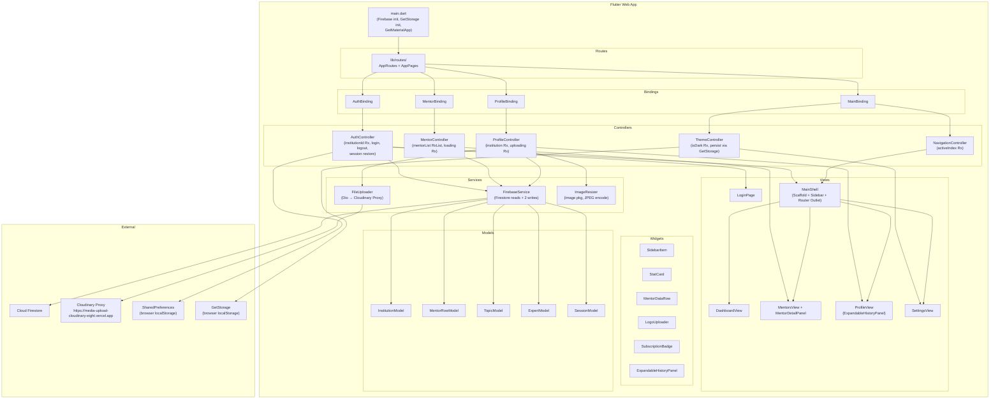

# Design Document — Institution Management Portal

## Overview

The Institution Management Portal is a Flutter Web application built on the GetX MVC pattern. Institutions authenticate via a custom Firestore credential check (no Firebase Auth), then access a responsive shell with sidebar navigation. The portal is strictly read-only against Firestore except for two approved writes (institution name and logo URL). Media uploads are routed through a Cloudinary REST proxy. Session persistence uses SharedPreferences; theme persistence uses GetStorage.

### Key Technology Decisions

| Concern | Choice | Rationale |
|---|---|---|
| State management | GetX ^4.6.5 | Reactive Rx observables, built-in DI, named routing |
| Backend reads | Cloud Firestore ^4.x | Live data, no Auth dependency |
| Firestore writes | 2 methods only | Strict data integrity constraint |
| Media upload | Cloudinary via REST proxy (Dio ^5.x) | Avoids direct SDK dependency |
| Image loading | CachedNetworkImage ^3.x | Browser-cache-aware, placeholder/error builders |
| Session persistence | SharedPreferences ^2.x | Key: `session_institution_id` |
| Theme persistence | GetStorage ^2.x | Lightweight localStorage wrapper |
| Image processing | image ^4.x | Pure-Dart resize + JPEG encode |
| File picking | image_picker_for_web ^3.x | Web-compatible file picker |
| Date formatting | intl ^0.18.x | `dd MMM yyyy` pattern |

---

## Architecture

### Component Relationship Diagram



### Data Flow Summary

1. **App start** → `main.dart` initialises Firebase, GetStorage, registers `ThemeController` and `AuthController` as permanent singletons, then reads `session_institution_id` from SharedPreferences.
2. **Login** → `AuthController.login()` queries Firestore via `FirebaseService`, stores `institutionId`, persists to SharedPreferences, navigates to `/shell`.
3. **Shell** → `MainShell` uses `NavigationController.activeIndex` to swap the content area between `DashboardView`, `MentorsView`, `ProfileView`, and `SettingsView`.
4. **Mentors** → `MentorController` queries topics, fans out parallel expert/session reads, builds `MentorRowModel` list.
5. **Profile writes** → `ProfileController` calls `FirebaseService.updateInstitutionName()` or `updateInstitutionLogoUrl()` — the only two Firestore write paths.
6. **Media upload** → `ImageResizer` → `FileUploader` → Cloudinary Proxy → URL returned → `ProfileController` writes URL to Firestore.

---

## Components and Interfaces

### Controllers

#### AuthController

```dart
class AuthController extends GetxController {
  // Observables
  final RxString institutionId = ''.obs;
  final RxBool isLoading = false.obs;
  final RxnString errorMessage = RxnString();

  // Dependencies
  final FirebaseService _firebaseService;
  final SharedPreferences _prefs;

  // Methods
  Future<void> login(String email, String institutionIdInput) async;
  Future<void> logout() async;
  Future<void> restoreSession() async;  // called from onInit
  bool get isAuthenticated => institutionId.value.isNotEmpty;

  // Validation (pure functions — testable)
  static bool isValidEmail(String email);
  static bool isValidInstitutionId(String id);
}
```

#### NavigationController

```dart
class NavigationController extends GetxController {
  final RxInt activeIndex = 0.obs;

  void navigateTo(int index);
  // index mapping: 0=Dashboard, 1=Mentors, 2=Profile, 3=Settings
}
```

#### MentorController

```dart
class MentorController extends GetxController {
  final RxList<MentorRowModel> mentorList = <MentorRowModel>[].obs;
  final RxBool isLoading = false.obs;
  final RxBool hasError = false.obs;
  final RxnString errorMessage = RxnString();

  final FirebaseService _firebaseService;

  Future<void> loadMentors(String institutionId) async;
  Future<void> reload(String institutionId) async;
}
```

#### ProfileController

```dart
class ProfileController extends GetxController {
  final Rxn<InstitutionModel> institution = Rxn<InstitutionModel>();
  final RxBool isUploadingLogo = false.obs;
  final RxBool isSavingName = false.obs;
  final RxnString nameError = RxnString();

  final FirebaseService _firebaseService;
  final FileUploader _fileUploader;
  final ImageResizer _imageResizer;

  Future<void> loadInstitution(String institutionId) async;
  Future<void> saveName(String institutionId, String newName) async;
  Future<void> pickAndUploadLogo(String institutionId) async;

  // Validation (pure function — testable)
  static String? validateName(String name);
  static bool isFileSizeValid(int bytes);  // <= 10 * 1024 * 1024
}
```

#### ThemeController

```dart
class ThemeController extends GetxController {
  final RxBool isDarkMode = false.obs;

  final GetStorage _storage;
  static const String _themeKey = 'theme_is_dark';

  @override
  void onInit();  // reads persisted preference

  void toggleTheme();
  ThemeData get currentTheme;
}
```

### Services

#### FirebaseService

```dart
class FirebaseService {
  final FirebaseFirestore _firestore;

  // --- READ METHODS ---

  /// Queries institutions collection for a document where email matches (case-insensitive).
  Future<InstitutionModel?> findInstitutionByEmail(String email);

  /// Reads a single institution document by institutionId field value.
  Future<InstitutionModel?> getInstitution(String institutionId);

  /// Queries topics collection where institutionId == institutionId.
  Future<List<TopicModel>> getTopicsForInstitution(String institutionId);

  /// Reads a single expert document.
  Future<ExpertModel?> getExpert(String expertId);

  /// Reads a single session document.
  Future<SessionModel?> getSession(String sessionId);

  // --- WRITE METHODS (exactly 2) ---

  /// Updates the name field on the institution document.
  Future<void> updateInstitutionName(String institutionId, String name);

  /// Updates the logoUrl field on the institution document.
  Future<void> updateInstitutionLogoUrl(String institutionId, String logoUrl);
}
```

> **Constraint**: No other write, set, update, or delete method exists on `FirebaseService`. No widget, controller, or service other than `FirebaseService` holds a `CollectionReference` or `DocumentReference` write reference.

#### FileUploader

```dart
class FileUploader {
  static const String _baseUrl =
      'https://media-upload-cloudinary-eight.vercel.app';
  static const Duration _timeout = Duration(seconds: 30);

  final Dio _dio;

  /// POST /upload-media — multipart upload.
  /// Returns map with at minimum keys: 'url', 'public_id'.
  /// Throws [CloudinaryException] on non-2xx response.
  Future<Map<String, dynamic>> uploadFile(
      Uint8List bytes, String filename) async;

  /// PUT /update-media?public_id=...&type=... — multipart update.
  /// Returns map with at minimum keys: 'url', 'public_id'.
  /// Throws [CloudinaryException] on non-2xx response.
  Future<Map<String, dynamic>> updateFile(
      Uint8List bytes, String publicId, String type, String filename) async;

  /// DELETE /delete-media?public_id=...&type=...
  /// Returns true on success.
  /// Throws [CloudinaryException] on non-2xx response.
  Future<bool> deleteFile(String publicId, String type) async;
}

class CloudinaryException implements Exception {
  final int statusCode;
  final String responseBody;
  const CloudinaryException(this.statusCode, this.responseBody);
}
```

#### ImageResizer

```dart
class ImageResizer {
  /// Decodes [bytes] as an image.
  /// If width > 500px, resizes to 500px width preserving aspect ratio.
  /// Encodes result as JPEG at quality 85.
  /// Throws [InvalidImageException] if bytes cannot be decoded.
  Future<Uint8List> resizeAndEncode(Uint8List bytes) async;
}

class InvalidImageException implements Exception {
  final String message;
  const InvalidImageException(this.message);
}
```

### Views and Widgets

#### LoginPage

Stateless widget. Renders a centred `Card` (max-width 480 px) with:
- `TextFormField` for email (maxLength: 254, keyboard: emailAddress)
- `TextFormField` for Institution ID (maxLength: 128, obscureText: true)
- Submit `ElevatedButton` (disabled while `AuthController.isLoading`)
- Inline error text below each field driven by `AuthController.errorMessage`

#### MainShell

`StatelessWidget` using `LayoutBuilder` to determine breakpoint. Composes:
- `Sidebar` widget (width 240/72/0 based on breakpoint)
- `Drawer` (mobile only, opened by hamburger `AppBar` action)
- `Obx` content area swapping between `DashboardView`, `MentorsView`, `ProfileView`, `SettingsView` based on `NavigationController.activeIndex`

#### MentorDetailPanel

- **Desktop (≥1024 px)**: `AnimatedContainer` sliding in from the right, overlaying the right portion of `MentorsView`. Dismissed by close button or outside tap.
- **Tablet/Mobile (<1024 px)**: Full `GetPage` route `/shell/mentors/detail/:expertId`.

#### ExpandableHistoryPanel

`StatelessWidget` wrapping an `ExpansionTile`. Sorted entries rendered as `DataTable` rows with `SubscriptionBadge` chips.

---

## Data Models

```dart
// lib/models/institution_model.dart
class InstitutionModel {
  final String id;           // Firestore field: id
  final String email;
  final String name;
  final String? logoUrl;
  final DateTime? subscriptionExpiry;
  final String? plan;
  final List<SubscriptionHistoryEntry> subscriptionHistory;

  factory InstitutionModel.fromFirestore(DocumentSnapshot doc);
  Map<String, dynamic> toMap();
}

class SubscriptionHistoryEntry {
  final DateTime startDate;
  final DateTime endDate;
  // Derived
  int get durationDays => endDate.difference(startDate).inDays;
  SubscriptionStatus get status {
    final now = DateTime.now().toUtc();
    if (now.isAfter(startDate) && now.isBefore(endDate) ||
        now.isAtSameMomentAs(startDate) || now.isAtSameMomentAs(endDate)) {
      return SubscriptionStatus.active;
    }
    return SubscriptionStatus.expired;
  }
}

enum SubscriptionStatus { active, expired }

// lib/models/mentor_row_model.dart
class MentorRowModel {
  final String expertId;
  final String mentorName;
  final String topicName;
  final String topicId;
  final String institutionId;
  final String sessionId;
  final String price;        // "Unknown" if session skipped/failed
  final String duration;     // "Unknown" if session skipped/failed
  final String sessionType;  // "Unknown" if session skipped/failed
  // Optional — fetched lazily for DetailPanel
  final String? bio;
  final String? profileImageUrl;
}

// lib/models/topic_model.dart
class TopicModel {
  final String topicId;
  final String name;
  final String expertId;
  final String sessionId;    // may be empty
  final String institutionId;
  final String? skillType;
  final String? status;
  final String? imageUrl;
  final String? sessionType;
  final String? description;

  factory TopicModel.fromFirestore(DocumentSnapshot doc);
}

// lib/models/expert_model.dart
class ExpertModel {
  final String expertId;
  final String name;
  final String? bio;
  final String? profileImageUrl;

  factory ExpertModel.fromFirestore(DocumentSnapshot doc);
}

// lib/models/session_model.dart
class SessionModel {
  final String sessionId;
  final String price;
  final String duration;
  final String sessionType;

  factory SessionModel.fromFirestore(DocumentSnapshot doc);
}
```

---

## Route Structure and GetX Named Routes

```dart
// lib/routes/app_routes.dart
abstract class AppRoutes {
  static const login    = '/login';
  static const shell    = '/shell';
  static const dashboard = '/shell/dashboard';
  static const mentors  = '/shell/mentors';
  static const mentorDetail = '/shell/mentors/detail/:expertId';
  static const profile  = '/shell/profile';
  static const settings = '/shell/settings';
}

// lib/routes/app_pages.dart
class AppPages {
  static final pages = [
    GetPage(
      name: AppRoutes.login,
      page: () => const LoginPage(),
      binding: AuthBinding(),
    ),
    GetPage(
      name: AppRoutes.shell,
      page: () => const MainShell(),
      binding: MainBinding(),
      middlewares: [AuthMiddleware()],
      children: [
        GetPage(
          name: '/dashboard',
          page: () => const DashboardView(),
        ),
        GetPage(
          name: '/mentors',
          page: () => const MentorsView(),
          binding: MentorBinding(),
        ),
        GetPage(
          name: '/mentors/detail/:expertId',
          page: () => const MentorDetailPanel(),
        ),
        GetPage(
          name: '/profile',
          page: () => const ProfileView(),
          binding: ProfileBinding(),
        ),
        GetPage(
          name: '/settings',
          page: () => const SettingsView(),
        ),
      ],
    ),
  ];
}
```

### Route Guard

```dart
// lib/routes/auth_middleware.dart
class AuthMiddleware extends GetMiddleware {
  @override
  RouteSettings? redirect(String? route) {
    final auth = Get.find<AuthController>();
    if (!auth.isAuthenticated) {
      return const RouteSettings(name: AppRoutes.login);
    }
    return null;
  }
}
```

---

## GetX Binding / Dependency Injection Setup

```dart
// lib/bindings/initial_binding.dart
class AuthBinding extends Bindings {
  @override
  void dependencies() {
    Get.lazyPut<FirebaseService>(() => FirebaseService(FirebaseFirestore.instance));
    Get.lazyPut<AuthController>(() => AuthController(
      firebaseService: Get.find(),
      prefs: Get.find<SharedPreferences>(),  // registered in main.dart
    ));
  }
}

// lib/bindings/main_binding.dart
class MainBinding extends Bindings {
  @override
  void dependencies() {
    Get.lazyPut<NavigationController>(() => NavigationController());
    // ThemeController is permanent singleton from main.dart
  }
}

// lib/bindings/mentor_binding.dart
class MentorBinding extends Bindings {
  @override
  void dependencies() {
    Get.lazyPut<MentorController>(() => MentorController(
      firebaseService: Get.find(),
    ));
  }
}

// lib/bindings/profile_binding.dart
class ProfileBinding extends Bindings {
  @override
  void dependencies() {
    Get.lazyPut<ImageResizer>(() => ImageResizer());
    Get.lazyPut<FileUploader>(() => FileUploader(Dio()));
    Get.lazyPut<ProfileController>(() => ProfileController(
      firebaseService: Get.find(),
      fileUploader: Get.find(),
      imageResizer: Get.find(),
    ));
  }
}
```

### main.dart Initialisation Sequence

```dart
void main() async {
  WidgetsFlutterBinding.ensureInitialized();
  await Firebase.initializeApp(options: DefaultFirebaseOptions.currentPlatform);
  await GetStorage.init();
  final prefs = await SharedPreferences.getInstance();
  Get.put<SharedPreferences>(prefs, permanent: true);
  Get.put<ThemeController>(ThemeController(GetStorage()), permanent: true);
  runApp(const InstitutionPortalApp());
}
```

---

## Responsive Layout Strategy

### Breakpoint Constants

```dart
// lib/utils/breakpoints.dart
abstract class Breakpoints {
  static const double mobile  = 768.0;   // < 768: mobile
  static const double tablet  = 1024.0;  // 768–1023: tablet
  static const double desktop = 1280.0;  // >= 1024: desktop
}
```

### Layout Decision Table

| Viewport | Sidebar | Detail Panel | Dashboard Grid | Profile Layout |
|---|---|---|---|---|
| ≥ 1280 px | 240 px expanded | Inline right panel | 3+ columns | 2-column |
| 1024–1279 px | 240 px expanded | Inline right panel | 2 columns | 2-column |
| 768–1023 px | 72 px icons + tooltips | Full-screen route | 1 column | 1-column |
| < 768 px | Hidden (Drawer) | Full-screen route | 1 column | 1-column |

### Implementation Pattern

```dart
// Inside MainShell build()
LayoutBuilder(
  builder: (context, constraints) {
    final width = constraints.maxWidth;
    final isMobile  = width < Breakpoints.mobile;
    final isTablet  = width >= Breakpoints.mobile && width < Breakpoints.tablet;
    final isDesktop = width >= Breakpoints.tablet;

    return Scaffold(
      appBar: isMobile ? AppBar(/* hamburger */) : null,
      drawer: isMobile ? NavigationDrawer(/* items */) : null,
      body: Row(
        children: [
          if (!isMobile) Sidebar(collapsed: isTablet),
          Expanded(child: /* content area */),
        ],
      ),
    );
  },
)
```

### Sidebar Widget

```dart
class Sidebar extends StatelessWidget {
  final bool collapsed;  // true = 72px icon-only mode

  // Width: collapsed ? 72.0 : 240.0
  // Each SidebarItem shows Tooltip wrapping icon when collapsed
  // Active item: filled Container background chip
  // Logout item pinned to bottom via Spacer()
}
```

---

## Error Handling

### Error Surface Map

| Error Source | Controller Response | UI Surface |
|---|---|---|
| Login Firestore query fails | `AuthController` catches, sets `errorMessage` | SnackBar (4 s) |
| Login credentials mismatch | `AuthController` sets `errorMessage` | Inline text below form |
| Topics query fails | `MentorController` sets `hasError = true` | Full-area error + Retry button |
| Individual expert/session read fails | `MentorController` logs, excludes row | SnackBar "Some mentor data could not be loaded." |
| Institution name write fails | `ProfileController` reverts name, sets error | SnackBar |
| Image > 10 MB | `ProfileController` aborts | SnackBar "Image must be 10 MB or smaller." |
| Image decode fails | `ImageResizer` throws `InvalidImageException` | SnackBar (caught by ProfileController) |
| Cloudinary upload fails (non-2xx) | `FileUploader` throws `CloudinaryException` | SnackBar (caught by ProfileController) |
| Logo URL write fails | `ProfileController` leaves existing logo | SnackBar |
| GetStorage read fails | `ThemeController` falls back to light theme | Silent fallback |
| Firestore timeout (>2 s) | `FirebaseService` surfaces as error | Caught by calling controller |

### Error Message Policy

- All user-visible error messages are plain English strings defined as constants in `lib/utils/error_messages.dart`.
- No raw exception text, stack traces, or internal identifiers are ever passed to `SnackBar`, `Banner`, or any widget.
- `FirebaseService` wraps all Firestore calls in try/catch and rethrows typed exceptions.

---

## Testing Strategy

### Dual Testing Approach

Unit tests cover specific examples, edge cases, and error conditions. Property-based tests verify universal properties across all inputs. Both are complementary.

### Property-Based Testing Library

**Package**: [`dart_test` + `fast_check`](https://pub.dev/packages/fast_check) (Dart property-based testing library).

Each property test runs a minimum of **100 iterations**.

Tag format for each property test:
```
// Feature: institution-portal, Property N: <property_text>
```

### Unit Test Focus Areas

- `AuthController.login()` with mock `FirebaseService` — credential match, mismatch, network error
- `MentorController.loadMentors()` with mock `FirebaseService` — success, partial failure, total failure, empty
- `ProfileController.saveName()` and `pickAndUploadLogo()` with mocks
- `ThemeController.toggleTheme()` and `onInit()` with mock `GetStorage`
- `FirebaseService` write methods with mock `FirebaseFirestore`
- Widget tests for `LoginPage`, `MainShell` breakpoints, `MentorsView` states, `ProfileView` states

### Integration Test Focus Areas

- Firestore query round-trip with emulator (topics, experts, sessions)
- Cloudinary proxy upload with mock HTTP server
- SharedPreferences session persistence across simulated page reload


---

## Correctness Properties

*A property is a characteristic or behavior that should hold true across all valid executions of a system — essentially, a formal statement about what the system should do. Properties serve as the bridge between human-readable specifications and machine-verifiable correctness guarantees.*

### Property Reflection (Redundancy Analysis)

Before writing the final properties, the following consolidations were made:

- **1.2 + 1.12 (email validation + length limit)**: Both test the `isValidEmail` pure function. Consolidated into one property that covers format AND length boundary.
- **1.9 + 1.11 (session restore + logout clears session)**: Both test the SharedPreferences round-trip. Consolidated into one property: store → restore → logout → verify cleared.
- **6.5 + 6.9 (name validation + file size validation)**: Both are pure validation functions but test different domains — kept separate.
- **7.4 + 7.5 (Active chip + Expired chip)**: Both test the same `SubscriptionStatus` classification function. Consolidated into one property covering both outcomes.
- **9.1 + 9.2 + 9.3 (uploadFile + updateFile + deleteFile)**: All test HTTP request construction. Kept separate because they test different HTTP methods and endpoints.
- **9.4 (CloudinaryException on non-2xx)**: Applies to all three FileUploader methods — consolidated into one property.
- **3.2 + 3.3 (mentor count + date formatting)**: Different domains — kept separate.
- **10.7 (URL updates on route transition)**: Covered by GetX named routing infrastructure — kept as a smoke test rather than a property.

---

### Property 1: Email Validation Correctness

*For any* string input to `AuthController.isValidEmail`, the function SHALL return `true` if and only if the string matches the pattern `[one or more non-whitespace chars]@[domain].[tld]` AND has a total length of 254 characters or fewer; it SHALL return `false` for all other inputs including empty strings, whitespace-only strings, strings missing `@`, strings missing a TLD, and strings exceeding 254 characters.

**Validates: Requirements 1.2, 1.12**

---

### Property 2: Institution ID Validation Correctness

*For any* string input to `AuthController.isValidInstitutionId`, the function SHALL return `true` if and only if the string is non-empty after trimming AND has a length of 128 characters or fewer; it SHALL return `false` for empty strings, whitespace-only strings, and strings exceeding 128 characters.

**Validates: Requirements 1.3, 1.12**

---

### Property 3: Session Persistence Round-Trip

*For any* non-empty `institutionId` string, after `AuthController` stores it via `login()`, a subsequent call to `restoreSession()` on a fresh controller instance reading from the same `SharedPreferences` SHALL restore the same `institutionId` value. After `logout()` is called, `SharedPreferences` SHALL no longer contain the `session_institution_id` key and `isAuthenticated` SHALL return `false`.

**Validates: Requirements 1.5, 1.9, 1.11**

---

### Property 4: Route Guard Blocks Unauthenticated Access

*For any* named route in `AppRoutes` that is not `/login`, when `AuthController.isAuthenticated` is `false`, `AuthMiddleware.redirect()` SHALL return a `RouteSettings` pointing to `AppRoutes.login` and SHALL NOT return `null`.

**Validates: Requirements 1.10**

---

### Property 5: Navigation Index Update

*For any* integer index in the range `[0, 3]`, calling `NavigationController.navigateTo(index)` SHALL set `activeIndex.value` to exactly that index; calling it a second time with the same index SHALL leave `activeIndex.value` unchanged (idempotent).

**Validates: Requirements 2.6**

---

### Property 6: Mentor Count Reactive Binding

*For any* list of `MentorRowModel` objects assigned to `MentorController.mentorList`, the value exposed to the Dashboard "Total Mentors" card SHALL equal `mentorList.length` immediately after the assignment, without requiring a page reload.

**Validates: Requirements 3.2**

---

### Property 7: Subscription Expiry Date Formatting

*For any* non-null `DateTime` value representing a subscription expiry, the formatted string produced by the portal's date formatter SHALL match the pattern `dd MMM yyyy` (e.g. "31 Dec 2026") using the `intl` package's `DateFormat('dd MMM yyyy')`. For a null expiry, the formatted output SHALL be the string `"—"`.

**Validates: Requirements 3.3**

---

### Property 8: MentorRow Construction from Topic/Expert/Session

*For any* `TopicModel` with a non-empty `sessionId`, a corresponding `ExpertModel`, and a corresponding `SessionModel`, `MentorController` SHALL build a `MentorRowModel` where: `expertId` equals the topic's `expertId`, `mentorName` equals the expert's `name`, `topicName` equals the topic's `name`, `price` equals the session's `price`, `duration` equals the session's `duration`, and `sessionType` equals the session's `sessionType`.

*For any* `TopicModel` with an empty or absent `sessionId`, the resulting `MentorRowModel` SHALL have `price`, `duration`, and `sessionType` all equal to the string `"Unknown"`.

**Validates: Requirements 4.2, 4.3**

---

### Property 9: Institution Name Validation

*For any* string input to `ProfileController.validateName`, the function SHALL return `null` (valid) if and only if the trimmed string has a length between 1 and 100 characters inclusive; it SHALL return a non-null error string for empty strings, whitespace-only strings, and strings whose trimmed length exceeds 100 characters.

**Validates: Requirements 6.5**

---

### Property 10: File Size Validation

*For any* integer byte count, `ProfileController.isFileSizeValid` SHALL return `true` if and only if the byte count is greater than 0 and less than or equal to `10 * 1024 * 1024` (10,485,760 bytes); it SHALL return `false` for 0 bytes and for any count exceeding the limit.

**Validates: Requirements 6.9**

---

### Property 11: ImageResizer Width Constraint

*For any* valid image `Uint8List` with original width `W`:
- If `W > 500`, the output image SHALL have width exactly 500 px, height proportionally scaled, and be encoded as JPEG.
- If `W <= 500`, the output image SHALL have width equal to `W` (unchanged), and be encoded as JPEG.

*For any* `Uint8List` that cannot be decoded as a valid image, `ImageResizer.resizeAndEncode` SHALL throw an `InvalidImageException`.

**Validates: Requirements 9.5, 9.6**

---

### Property 12: FileUploader Request Construction

*For any* `Uint8List` of valid bytes and a filename string, `FileUploader.uploadFile` SHALL send a multipart POST request to `{baseUrl}/upload-media` containing the bytes under a `file` field and return a `Map` containing at minimum the keys `url` and `public_id`.

*For any* `Uint8List`, `publicId`, `type`, and `filename`, `FileUploader.updateFile` SHALL send a multipart PUT request to `{baseUrl}/update-media` with `public_id` and `type` as query parameters.

*For any* `publicId` and `type`, `FileUploader.deleteFile` SHALL send a DELETE request to `{baseUrl}/delete-media` with `public_id` and `type` as query parameters and return `true` on a 2xx response.

**Validates: Requirements 9.1, 9.2, 9.3**

---

### Property 13: CloudinaryException on Non-2xx Response

*For any* HTTP response with a status code outside the range `[200, 299]` returned by the Cloudinary Proxy, all three `FileUploader` methods (`uploadFile`, `updateFile`, `deleteFile`) SHALL throw a `CloudinaryException` whose `statusCode` field equals the response status code and whose `responseBody` field equals the raw response body string.

**Validates: Requirements 9.4**

---

### Property 14: Subscription History Sort Order

*For any* list of `SubscriptionHistoryEntry` objects with distinct `startDate` values, the list rendered by `ExpandableHistoryPanel` SHALL be sorted in descending order by `startDate` such that for every adjacent pair of rendered entries `(a, b)`, `a.startDate` is after `b.startDate`.

**Validates: Requirements 7.3**

---

### Property 15: Subscription Status Classification

*For any* `SubscriptionHistoryEntry` and any reference `DateTime now` (UTC):
- If `now >= entry.startDate && now <= entry.endDate`, the `status` getter SHALL return `SubscriptionStatus.active`.
- If `now > entry.endDate`, the `status` getter SHALL return `SubscriptionStatus.expired`.

**Validates: Requirements 7.4, 7.5**

---

### Property 16: Theme Toggle Round-Trip

*For any* initial theme state (dark or light), calling `ThemeController.toggleTheme()` SHALL switch to the opposite state. Calling `toggleTheme()` twice in succession SHALL return to the original state (round-trip / involution property).

**Validates: Requirements 8.2**

---

### Property 17: Theme Persistence Round-Trip

*For any* theme preference (dark or light) persisted to `GetStorage` by `ThemeController`, a fresh `ThemeController` instance reading from the same `GetStorage` SHALL restore the same theme preference in `onInit()` before the first frame renders.

**Validates: Requirements 8.3**

---

### Property 18: FirebaseService Write Method Exclusivity

*For any* instance of `FirebaseService`, the set of methods that perform a Firestore write operation SHALL contain exactly two members: `updateInstitutionName` and `updateInstitutionLogoUrl`. No method on `FirebaseService` SHALL write to the `topics`, `experts`, or `sessions` collections, and no method SHALL create or delete an `institutions` document.

**Validates: Requirements 12.1, 12.2, 12.3, 12.4, 12.5**

---
