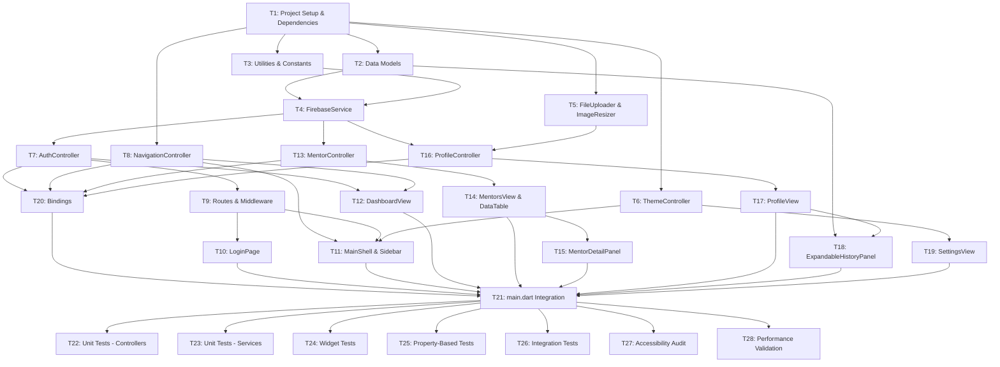

# Tasks — Institution Management Portal

## Task Dependency Graph

---

## Task 1: Project Setup & Dependencies

**Status:** `pending`

**Description:** Configure pubspec.yaml with all required packages, update Firebase configuration for web, and verify the project builds successfully for web target.

**Acceptance Criteria:**
- [x] pubspec.yaml includes all packages: get ^4.6.5, cloud_firestore ^4.x, firebase_core ^4.7.0, dio ^5.x, image_picker_for_web ^3.x, image ^4.x, get_storage ^2.x, shared_preferences ^2.x, cached_network_image ^3.x, intl ^0.18.x
- [x] Firebase web configuration is present in web/index.html or generated via FlutterFire CLI
- [x] `flutter pub get` completes without errors
- [x] `flutter build web` completes successfully
- [x] Project runs in Chrome with `flutter run -d chrome` without errors

**Dependencies:** None

**Estimated Effort:** 1 hour

---

## Task 2: Data Models

**Status:** `pending`

**Description:** Implement all Dart data model classes with Firestore serialization: InstitutionModel, MentorRowModel, TopicModel, ExpertModel, SessionModel, SubscriptionHistoryEntry, and SubscriptionStatus enum.

**Acceptance Criteria:**
- [x] InstitutionModel.fromFirestore() correctly parses all fields including subscriptionHistory array
- [x] SubscriptionHistoryEntry.status getter correctly classifies Active/Expired based on UTC date comparison
- [x] SubscriptionHistoryEntry.durationDays correctly calculates difference in whole days
- [x] TopicModel.fromFirestore() handles empty sessionId field
- [x] ExpertModel.fromFirestore() handles optional bio and profileImageUrl
- [x] SessionModel.fromFirestore() parses price, duration, sessionType as strings
- [x] MentorRowModel constructor accepts optional bio and profileImageUrl
- [x] All models have toMap() methods for Firestore writes where applicable

**Dependencies:** T1

**Estimated Effort:** 3 hours

---

## Task 3: Utilities & Constants

**Status:** `pending`

**Description:** Create utility classes and constants: Breakpoints, ErrorMessages, and date formatting helpers.

**Acceptance Criteria:**
- [x] lib/utils/breakpoints.dart defines mobile (768.0), tablet (1024.0), desktop (1280.0) constants
- [x] lib/utils/error_messages.dart defines all user-facing error strings as constants
- [x] lib/utils/date_formatter.dart provides formatSubscriptionDate(DateTime?) returning "dd MMM yyyy" or "—"
- [x] All constants are documented with inline comments

**Dependencies:** T1

**Estimated Effort:** 1 hour

---

## Task 4: FirebaseService

**Status:** `pending`

**Description:** Implement FirebaseService with exactly 5 read methods and 2 write methods. Enforce the write constraint: no other write/delete methods exist.

**Acceptance Criteria:**
- [x] findInstitutionByEmail(String email) queries institutions collection with case-insensitive email match
- [x] getInstitution(String institutionId) reads institution document by id field value (not doc ID)
- [x] getTopicsForInstitution(String institutionId) queries topics where institutionId == institutionId
- [x] getExpert(String expertId) reads experts/{expertId} document
- [x] getSession(String sessionId) reads sessions/{sessionId} document
- [x] updateInstitutionName(String institutionId, String name) updates institutions/{docId}.name field only
- [x] updateInstitutionLogoUrl(String institutionId, String logoUrl) updates institutions/{docId}.logoUrl field only
- [x] All methods wrap Firestore calls in try/catch and rethrow typed exceptions
- [x] No other write, set, update, or delete method exists on FirebaseService
- [x] All methods have timeout of 2 seconds configured via Firestore settings

**Dependencies:** T1, T2, T3

**Estimated Effort:** 4 hours

---

## Task 5: FileUploader & ImageResizer

**Status:** `pending`

**Description:** Implement FileUploader with Dio for Cloudinary REST API calls, and ImageResizer using the image package for JPEG encoding at quality 85.

**Acceptance Criteria:**
- [x] FileUploader.uploadFile() sends multipart POST to /upload-media with 30s timeout
- [x] FileUploader.updateFile() sends multipart PUT to /update-media with public_id and type query params
- [x] FileUploader.deleteFile() sends DELETE to /delete-media with public_id and type query params
- [x] All FileUploader methods throw CloudinaryException on non-2xx response with statusCode and responseBody
- [x] ImageResizer.resizeAndEncode() decodes image, resizes to 500px width if > 500px, encodes as JPEG quality 85
- [x] ImageResizer throws InvalidImageException if bytes cannot be decoded
- [x] CloudinaryException and InvalidImageException classes are defined with required fields

**Dependencies:** T1

**Estimated Effort:** 3 hours

---

## Task 6: ThemeController

**Status:** `pending`

**Description:** Implement ThemeController with GetX, GetStorage persistence, and light/dark ThemeData definitions.

**Acceptance Criteria:**
- [x] ThemeController.isDarkMode is an RxBool observable
- [x] onInit() reads 'theme_is_dark' key from GetStorage and applies theme before first frame
- [x] toggleTheme() switches isDarkMode and persists to GetStorage
- [x] currentTheme getter returns ThemeData.dark() or ThemeData.light() based on isDarkMode
- [x] All theme colors use ThemeData tokens (no hardcoded Color values)
- [x] Falls back to light theme if GetStorage read fails

**Dependencies:** T1

**Estimated Effort:** 2 hours

---

## Task 7: AuthController

**Status:** `pending`

**Description:** Implement AuthController with login, logout, session restore, and validation methods. Integrate SharedPreferences for session persistence.

**Acceptance Criteria:**
- [x] institutionId, isLoading, errorMessage are Rx observables
- [x] login(email, institutionIdInput) validates inputs, queries FirebaseService, stores institutionId in memory AND SharedPreferences under key 'session_institution_id'
- [x] logout() clears institutionId from memory and removes 'session_institution_id' from SharedPreferences
- [x] restoreSession() reads 'session_institution_id' from SharedPreferences on onInit and restores institutionId if present
- [x] isAuthenticated getter returns true when institutionId is non-empty
- [x] isValidEmail(String) static method validates format and length <= 254
- [x] isValidInstitutionId(String) static method validates non-empty trimmed and length <= 128
- [x] All async errors are caught and surfaced via errorMessage observable

**Dependencies:** T1, T4

**Estimated Effort:** 4 hours

---

## Task 8: NavigationController

**Status:** `pending`

**Description:** Implement NavigationController with activeIndex observable and navigateTo method.

**Acceptance Criteria:**
- [x] activeIndex is an RxInt observable initialized to 0
- [x] navigateTo(int index) sets activeIndex.value to index
- [x] Index mapping documented: 0=Dashboard, 1=Mentors, 2=Profile, 3=Settings

**Dependencies:** T1

**Estimated Effort:** 30 minutes

---

## Task 9: Routes & Middleware

**Status:** `pending`

**Description:** Define AppRoutes constants, AppPages GetPage list, and AuthMiddleware route guard.

**Acceptance Criteria:**
- [x] AppRoutes defines: login, shell, dashboard, mentors, mentorDetail, profile, settings
- [x] AppPages.pages includes all routes with correct bindings
- [x] AuthMiddleware.redirect() checks AuthController.isAuthenticated and redirects to /login if false
- [x] Shell route has AuthMiddleware in middlewares list
- [x] Child routes under /shell are correctly nested

**Dependencies:** T7

**Estimated Effort:** 2 hours

---

## Task 10: LoginPage

**Status:** `pending`

**Description:** Build LoginPage UI with email and Institution ID fields, validation, loading state, and error display.

**Acceptance Criteria:**
- [x] Full-page centered Card with max-width 480px
- [x] Email TextFormField with maxLength 254, keyboard type emailAddress
- [x] Institution ID TextFormField with maxLength 128, obscureText true
- [x] Submit button disabled while AuthController.isLoading is true
- [x] Loading spinner shown inside button while isLoading
- [x] Inline error text below fields driven by AuthController.errorMessage
- [x] Enter key triggers login
- [x] Form does not clear on validation error

**Dependencies:** T7, T9

**Estimated Effort:** 3 hours

---

## Task 11: MainShell & Sidebar

**Status:** `pending`

**Description:** Build MainShell with LayoutBuilder for responsive breakpoints, Sidebar widget with collapse logic, and Drawer for mobile.

**Acceptance Criteria:**
- [x] LayoutBuilder determines isMobile, isTablet, isDesktop based on Breakpoints constants
- [x] Sidebar width is 240px on desktop, 72px on tablet, hidden on mobile
- [x] Sidebar shows icon + label on desktop, icon + tooltip on tablet
- [x] Hamburger AppBar shown on mobile, opens Drawer with full navigation items
- [x] Active section highlighted with filled background chip driven by NavigationController.activeIndex
- [x] Logout item positioned at bottom of sidebar via Spacer
- [x] Content area uses Obx to swap between DashboardView, MentorsView, ProfileView, SettingsView based on activeIndex
- [x] Sidebar items trigger NavigationController.navigateTo(index)

**Dependencies:** T8, T9, T6

**Estimated Effort:** 5 hours

---

## Task 12: DashboardView

**Status:** `pending`

**Description:** Build DashboardView with StatCard widgets for Total Mentors and Subscription Expiry, responsive grid layout, and reload button.

**Acceptance Criteria:**
- [x] Total Mentors card displays MentorController.mentorList.length reactively via Obx
- [x] Subscription Expiry card displays formatted date from ProfileController.institution.subscriptionExpiry or "—"
- [x] Grid uses 3+ columns on >=1280px, 2 columns on 1024-1279px, 1 column on <1024px
- [x] Reload button triggers MentorController.reload() and ProfileController.loadInstitution()
- [x] Material Banner shown on fetch error with Retry action
- [x] StatCard widget is reusable with title, value, icon parameters

**Dependencies:** T7, T8

**Estimated Effort:** 3 hours

---

## Task 13: MentorController

**Status:** `pending`

**Description:** Implement MentorController with 3-stage parallel data loading: topics query, parallel expert/session reads, MentorRow construction.

**Acceptance Criteria:**
- [x] mentorList is RxList<MentorRowModel>
- [x] isLoading, hasError, errorMessage are Rx observables
- [x] loadMentors(institutionId) queries topics via FirebaseService
- [x] For each topic, parallel Future.wait reads expert and session (skip session if sessionId empty)
- [x] MentorRow built with price/duration/sessionType = "Unknown" if session skipped or failed
- [x] Individual expert/session failures logged and excluded from list, SnackBar shown
- [x] Total topics query failure sets hasError = true
- [x] reload(institutionId) clears mentorList and calls loadMentors

**Dependencies:** T4

**Estimated Effort:** 5 hours

---

## Task 14: MentorsView & DataTable

**Status:** `pending`

**Description:** Build MentorsView with DataTable showing mentor rows, LinearProgressIndicator, empty state, and error state.

**Acceptance Criteria:**
- [x] LinearProgressIndicator shown at top while MentorController.isLoading
- [x] DataTable with columns: ID (expertId), Mentor Name, Topic Name, Price
- [x] DataTable rows built from MentorController.mentorList via Obx
- [x] Empty state message "No mentors are linked to your institution." shown when mentorList is empty
- [x] Full-area error state with Retry button shown when MentorController.hasError is true
- [x] Row tap triggers navigation to detail panel (desktop) or detail route (mobile/tablet)

**Dependencies:** T13

**Estimated Effort:** 4 hours

---

## Task 15: MentorDetailPanel

**Status:** `pending`

**Description:** Build MentorDetailPanel with responsive behavior: inline side panel on desktop, full-screen route on mobile/tablet. Lazy-fetch bio and profileImageUrl.

**Acceptance Criteria:**
- [x] On desktop (>=1024px), AnimatedContainer slides in from right, overlays MentorsView
- [x] On mobile/tablet (<1024px), navigates to /shell/mentors/detail/:expertId route
- [x] Displays: Expert ID, Full Name, Bio, Profile Image, Topic Name, Topic ID, Institution ID, Session ID, Price, Duration, Session Type
- [x] Fetches Expert document for bio and profileImageUrl if not present in MentorRow
- [x] CachedNetworkImage used for profile image with placeholder and error builders
- [x] Close button and outside tap dismiss panel on desktop
- [x] Back button navigates away on mobile/tablet

**Dependencies:** T14

**Estimated Effort:** 4 hours

---

## Task 16: ProfileController

**Status:** `pending`

**Description:** Implement ProfileController with institution loading, name save validation, and logo upload flow via ImageResizer and FileUploader.

**Acceptance Criteria:**
- [x] institution is Rxn<InstitutionModel>
- [x] isUploadingLogo, isSavingName, nameError are Rx observables
- [x] loadInstitution(institutionId) fetches institution via FirebaseService
- [x] saveName(institutionId, newName) validates via validateName(), calls FirebaseService.updateInstitutionName(), shows SnackBar
- [x] pickAndUploadLogo(institutionId) opens file picker (JPEG/PNG only), checks size <= 10MB, calls ImageResizer, calls FileUploader, calls FirebaseService.updateInstitutionLogoUrl()
- [x] validateName(String) static method returns null if trimmed length 1-100, error string otherwise
- [x] isFileSizeValid(int bytes) static method returns true if 0 < bytes <= 10485760
- [x] All errors caught and displayed via SnackBar

**Dependencies:** T4, T5

**Estimated Effort:** 5 hours

---

## Task 17: ProfileView

**Status:** `pending`

**Description:** Build ProfileView with inline-editable name field, tappable logo with CachedNetworkImage, read-only subscription fields, and responsive layout.

**Acceptance Criteria:**
- [x] Two-column layout on >=1024px, single-column on <1024px
- [x] Institution name shown as editable TextField with Save/Cancel buttons on edit
- [x] Logo shown as circular CachedNetworkImage, tappable to upload
- [x] Subscription expiry and plan shown as read-only Text
- [x] Loading indicator over logo area while ProfileController.isUploadingLogo
- [x] Logo tap disabled while uploading
- [x] Name validation error shown inline if ProfileController.nameError is set
- [x] Success SnackBar "Institution name updated." on successful save

**Dependencies:** T16

**Estimated Effort:** 4 hours

---

## Task 18: ExpandableHistoryPanel

**Status:** `pending`

**Description:** Build ExpandableHistoryPanel widget with ExpansionTile, sorted subscription history entries, and status chips.

**Acceptance Criteria:**
- [x] ExpansionTile collapsed by default
- [x] Reads subscriptionHistory array from ProfileController.institution
- [x] Sorts entries by startDate descending (most recent first)
- [x] Each row shows: start date (dd MMM yyyy), end date (dd MMM yyyy), duration (e.g. "30 days"), status chip
- [x] Green "Active" chip if current UTC date is within [startDate, endDate]
- [x] Grey "Expired" chip if current UTC date is after endDate
- [x] Empty state message "No previous subscriptions found." if array is empty or absent

**Dependencies:** T2, T17

**Estimated Effort:** 3 hours

---

## Task 19: SettingsView

**Status:** `pending`

**Description:** Build SettingsView with theme toggle row, label that reflects current state, and secondary text.

**Acceptance Criteria:**
- [x] Toggle row shows "Dark Mode" label when light theme is active
- [x] Toggle row shows "Light Mode" label when dark theme is active
- [x] Secondary text shows current state (e.g. "Currently using light theme")
- [x] Toggle activates ThemeController.toggleTheme()
- [x] Theme switches immediately via Obx

**Dependencies:** T6

**Estimated Effort:** 2 hours

---

## Task 20: Bindings

**Status:** `pending`

**Description:** Implement all GetX Bindings: AuthBinding, MainBinding, MentorBinding, ProfileBinding.

**Acceptance Criteria:**
- [x] AuthBinding registers FirebaseService and AuthController with Get.lazyPut
- [x] MainBinding registers NavigationController with Get.lazyPut
- [x] MentorBinding registers MentorController with Get.lazyPut
- [x] ProfileBinding registers ImageResizer, FileUploader, ProfileController with Get.lazyPut
- [x] All bindings use Get.find() to inject dependencies from permanent singletons (SharedPreferences, ThemeController)

**Dependencies:** T7, T8, T13, T16

**Estimated Effort:** 2 hours

---

## Task 21: main.dart Integration

**Status:** `pending`

**Description:** Implement main.dart with Firebase init, GetStorage init, SharedPreferences registration, ThemeController registration, and GetMaterialApp setup.

**Acceptance Criteria:**
- [x] WidgetsFlutterBinding.ensureInitialized() called
- [x] Firebase.initializeApp() awaited with DefaultFirebaseOptions.currentPlatform
- [x] GetStorage.init() awaited
- [x] SharedPreferences.getInstance() awaited and registered as permanent singleton via Get.put
- [x] ThemeController registered as permanent singleton via Get.put
- [x] GetMaterialApp uses AppPages.pages, initialRoute determined by AuthController.isAuthenticated
- [x] ThemeController.currentTheme bound to GetMaterialApp.theme and darkTheme
- [x] App runs without errors and shows LoginPage or MainShell based on session

**Dependencies:** T10, T11, T12, T14, T15, T17, T18, T19, T20

**Estimated Effort:** 2 hours

---

## Task 22: Unit Tests - Controllers

**Status:** `pending`

**Description:** Write unit tests for all controllers using mocks: AuthController, NavigationController, MentorController, ProfileController, ThemeController.

**Acceptance Criteria:**
- [ ] AuthController.login() tested with mock FirebaseService: success, credential mismatch, network error
- [ ] AuthController.restoreSession() tested with mock SharedPreferences: session present, session absent
- [ ] AuthController.logout() tested: clears institutionId and removes SharedPreferences key
- [ ] NavigationController.navigateTo() tested: sets activeIndex correctly
- [ ] MentorController.loadMentors() tested: success, partial failure, total failure, empty topics
- [ ] ProfileController.saveName() tested: valid name, invalid name, Firestore write failure
- [ ] ProfileController.pickAndUploadLogo() tested: success, file too large, image decode failure, upload failure
- [ ] ThemeController.toggleTheme() tested: switches isDarkMode and persists to GetStorage
- [ ] ThemeController.onInit() tested: restores theme from GetStorage, falls back to light on failure
- [ ] All tests use mockito or mocktail for mocking dependencies

**Dependencies:** T21

**Estimated Effort:** 6 hours

---

## Task 23: Unit Tests - Services

**Status:** `pending`

**Description:** Write unit tests for FirebaseService, FileUploader, ImageResizer using mocks and fake data.

**Acceptance Criteria:**
- [ ] FirebaseService.findInstitutionByEmail() tested with mock Firestore: found, not found
- [ ] FirebaseService.getTopicsForInstitution() tested: multiple topics, zero topics
- [ ] FirebaseService.updateInstitutionName() tested: success, write failure
- [ ] FirebaseService.updateInstitutionLogoUrl() tested: success, write failure
- [ ] FileUploader.uploadFile() tested with mock Dio: 200 response, 500 response throws CloudinaryException
- [ ] FileUploader.updateFile() tested: success, non-2xx throws CloudinaryException
- [ ] FileUploader.deleteFile() tested: success, non-2xx throws CloudinaryException
- [ ] ImageResizer.resizeAndEncode() tested: image > 500px resized, image <= 500px unchanged, invalid bytes throw InvalidImageException

**Dependencies:** T21

**Estimated Effort:** 5 hours

---

## Task 24: Widget Tests

**Status:** `pending`

**Description:** Write widget tests for LoginPage, MainShell breakpoints, MentorsView states, ProfileView states, SettingsView.

**Acceptance Criteria:**
- [ ] LoginPage: email field validation, Institution ID field validation, submit button disabled while loading, error message display
- [ ] MainShell: sidebar width 240px on desktop, 72px on tablet, hidden on mobile, Drawer opens on mobile
- [ ] MentorsView: LinearProgressIndicator shown while loading, DataTable shown with data, empty state shown, error state shown
- [ ] ProfileView: name field editable, Save/Cancel buttons shown, logo tappable, loading indicator shown while uploading
- [ ] SettingsView: toggle switches theme, label updates
- [ ] All widget tests use flutter_test and pump widgets with mock controllers

**Dependencies:** T21

**Estimated Effort:** 6 hours

---

## Task 25: Property-Based Tests

**Status:** `pending`

**Description:** Write property-based tests using fast_check package for all 18 correctness properties defined in design.md.

**Acceptance Criteria:**
- [ ] Property 1: Email validation correctness (100 iterations)
- [ ] Property 2: Institution ID validation correctness (100 iterations)
- [ ] Property 3: Session persistence round-trip (100 iterations)
- [ ] Property 4: Route guard blocks unauthenticated access (100 iterations)
- [ ] Property 5: Navigation index update idempotent (100 iterations)
- [ ] Property 6: Mentor count reactive binding (100 iterations)
- [ ] Property 7: Subscription expiry date formatting (100 iterations)
- [ ] Property 8: MentorRow construction from Topic/Expert/Session (100 iterations)
- [ ] Property 9: Institution name validation (100 iterations)
- [ ] Property 10: File size validation (100 iterations)
- [ ] Property 11: ImageResizer width constraint (100 iterations)
- [ ] Property 12: FileUploader request construction (100 iterations)
- [ ] Property 13: CloudinaryException on non-2xx (100 iterations)
- [ ] Property 14: Subscription history sort order (100 iterations)
- [ ] Property 15: Subscription status classification (100 iterations)
- [ ] Property 16: Theme toggle round-trip (100 iterations)
- [ ] Property 17: Theme persistence round-trip (100 iterations)
- [ ] Property 18: FirebaseService write method exclusivity (100 iterations)
- [ ] All property tests tagged with "Feature: institution-portal, Property N: <text>"

**Dependencies:** T21

**Estimated Effort:** 8 hours

---

## Task 26: Integration Tests

**Status:** `pending`

**Description:** Write integration tests for Firestore round-trip with emulator, Cloudinary proxy upload with mock server, and SharedPreferences session persistence.

**Acceptance Criteria:**
- [ ] Firestore emulator configured and running for integration tests
- [ ] Test: query topics, read experts and sessions, build MentorRow list end-to-end
- [ ] Test: write institution name, read back, verify updated
- [ ] Test: write institution logoUrl, read back, verify updated
- [ ] Mock HTTP server configured for Cloudinary proxy tests
- [ ] Test: upload file, verify POST request format, verify response parsing
- [ ] Test: update file, verify PUT request format with query params
- [ ] Test: delete file, verify DELETE request format
- [ ] Test: store institutionId in SharedPreferences, simulate app restart, verify restored
- [ ] All integration tests run in CI environment

**Dependencies:** T21

**Estimated Effort:** 6 hours

---

## Task 27: Accessibility Audit

**Status:** `pending`

**Description:** Audit all interactive elements for keyboard navigation, ARIA labels, focus indicators, and focus trapping in modals/drawers.

**Acceptance Criteria:**
- [ ] All sidebar items, form fields, buttons, table rows are keyboard navigable
- [ ] Tab order follows visual reading order (left-to-right, top-to-bottom)
- [ ] All icon-only buttons have Semantics labels: hamburger menu, reload button, collapsed sidebar icons
- [ ] Focus indicator visible on all focusable elements, meets WCAG 2.1 SC 2.4.7 (2px solid outline)
- [ ] Drawer traps focus when open, returns focus to hamburger button when closed
- [ ] Detail panel (desktop) traps focus when open, returns focus to table row when closed
- [ ] No focus trap outside of intentional modal contexts
- [ ] Accessibility audit report generated with findings and fixes

**Dependencies:** T21

**Estimated Effort:** 4 hours

---

## Task 28: Performance Validation

**Status:** `pending`

**Description:** Validate that Firestore queries complete within 2s, initial load completes within 3s, and no raw exceptions are rendered in UI.

**Acceptance Criteria:**
- [ ] Firestore query performance measured on 10 Mbps connection: all queries < 2s
- [ ] Initial load performance measured on 10 Mbps connection: login screen renders < 3s
- [ ] Mentor data loading with 50+ topics completes within acceptable time
- [ ] Logo upload with 5MB image completes within 35s (30s timeout + processing)
- [ ] Manual inspection confirms no raw exception text, stack traces, or internal error IDs visible in UI
- [ ] All error messages are plain English from ErrorMessages constants
- [ ] Performance report generated with metrics and recommendations

**Dependencies:** T21

**Estimated Effort:** 3 hours

---

## Summary

**Total Tasks:** 28  
**Total Estimated Effort:** 105 hours (~13 working days for 1 developer)

**Critical Path:** T1 → T2 → T4 → T7 → T9 → T10 → T21 → T22/T23/T24/T25/T26 → T27/T28

**Parallel Work Opportunities:**
- T2, T3, T5, T6, T8 can be done in parallel after T1
- T10, T11, T12 can be done in parallel after T9
- T13, T16 can be done in parallel after T4
- T22, T23, T24, T25, T26 can be done in parallel after T21
- T27, T28 can be done in parallel after T21

**Testing Coverage:**
- Unit tests: T22, T23 (11 hours)
- Widget tests: T24 (6 hours)
- Property-based tests: T25 (8 hours)
- Integration tests: T26 (6 hours)
- Accessibility audit: T27 (4 hours)
- Performance validation: T28 (3 hours)
- **Total testing effort:** 38 hours (36% of total)
